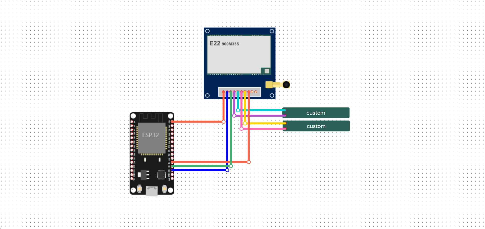
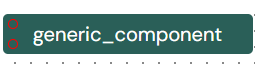
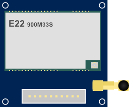
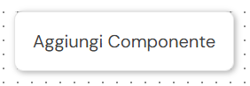
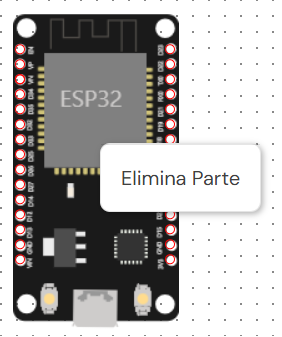
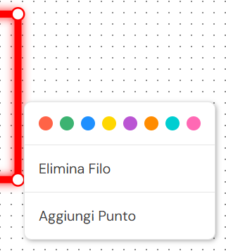

# Editor Componenti

Questa repo contiene una libreria javascript per realizzare un editor che permette di rappresentare configurazioni tra moduli connessi tra di loro mediante un diagrama strutturato JSON.

## Componenti
Una componente non è altro che un oggetto che possiede un determinato schema nella cartella "res/components/" nel formato ***<id_componente>**.json* con una struttura del tipo:

```
{
    "name":"sample_component"
    "size": [width,height]            // [Opzionale]
    "preview": "sample_component.png" // [Opzionale]
    "pins": [
        ["pin_id", pin_pos_x, pin_pos_y, pin_description],
        ...
    ]
}
```

In base a i parametri utilizzati si possono realizzare rappresentazioni generiche o più dettagliate delle componenti che si vuole utilizzare nell'editor.

### Esempi di componenti
| Esempio di componente generica (no preview) | Esempio di componente realistica (con preview) |
| :---: | :---: |
| |  |
| ``` { "name": "generic_component", "size": [200, 32], "pins": [ ["PIN1", 8, 8], ["PIN2", 8, 24] ] } ``` | ``` { "name": "lora_board", "preview": "lora_board.png", "pins": [ ["3V3", 58, 191], ["GND", 69, 191], ["NRST", 80,191], ["DIO1", 90,191], ["SCK", 101, 191], ["NSS", 112, 191], ["BUSY", 122,191], ["NISO", 133,191], ["MOSI", 143,191], ["RXEN", 154,191]]} ``` |
| Questa configurazione genera un componente con base verde e pin sulle posizioni specificate. | Questa configurazione genera un componente con una preview che replica la componente reale con dei pin sulle posizioni specificate. |

## Implementazione Editor
Per implementare l'editor basta caricare il lo script js per la logica di funzionamento e lo stile css per la rappresentazione visiva.

Una volta importato lo script basta inizializzarelo passando l'id del container in cui generarlo.
```
import { Editor } from "./res/Editor.js";
const editor = new Editor("myEditor");
```
Successivamente basterà avviare il processo di caricamento del diagramma con:
```
editor.loadDiagram(diagram);
```
**Lo script si occuperà di caricare i relativi schema per rappresentare le componenti**

> [!NOTE]
> Il file components-list.json contiene la lista di tutte le componenti presenti in res/components/ come riferimento per il menù contestuale affinchè si possano aggiungere nuovi componenti al diagramma

## Funzionalità
### Pan e Zoom in/Out
L'editor possiede n sistema per spostare, zoommare e de-zoomare la vista del diagramma attraverso l'uso del mouse

### Menu Contestuale
Il menù contestuale è un menù di supporto che permette di effettuare varie operazioni attraverso il click sinistro del mouse su un specifico punto:

|  |  |  |
|:--:|:--:|:--:|
| *Click su un'area vuota della vista* | *Click su una componente nella vista* | *Click su una connessione nella vista* |